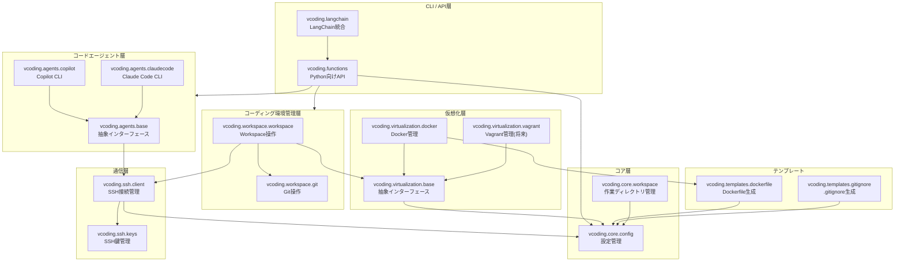

# 仮想化開発環境オーケストレーションツール 仕様書

## 1. 目的・背景

本ソフトウェアは、セキュリティと再現性を重視した
**仮想化ベースの開発・実行環境**を提供することを目的とする。

- 開発環境・実行環境の双方を仮想環境内に閉じる
- コンテナを中心に、VM 等の仮想化方式にも対応可能な設計とする
- GitHub Copilot CLI / Cloud Code 等の **コードエージェントを安全に実行**できる環境を提供する
- 環境は何度でも作り直せることを前提とし、結果の再現性を重視する

初期実装は **Python** により行う。

---

## 2. 全体アーキテクチャ概要

### 2.1 構成概要

- ホスト環境
  - Python API / CLI
  - Git 管理機能
  - SSH クライアント
- 仮想環境（主にコンテナ）
  - 開発用コンテナ（常駐）
    - SSH サーバ
    - GitHub Copilot CLI
    - Cloud Code 等の CLI
    - 内部作業用ワークディレクトリ

ホスト ⇔ コンテナ間は **SSH を用いた通信**を基本とする。

---

## 3. 仮想化方式に関する設計方針

### 3.1 ロジック層による仮想化方式分離

- Docker / Vagrant 等の仮想化方式はロジック層で分離する
- 上位レイヤは仮想化方式を意識しない

### 3.2 対応方針

- 初期対応：Docker
- 将来対応：Vagrant / その他 VM 系仮想化

---

## 4. コンテナ構築仕様

### 4.1 ユーザー提供ファイルの扱い

- ユーザーは以下を **そのまま提供**する
  - Dockerfile（必須）
  - 必要に応じた設定ファイル
- Dockerfile を独自 DSL や共通 YAML に変換しない
  - 共通化よりも柔軟性・理解容易性を優先する

### 4.2 Dockerfile 拡張方針

- ユーザー提供 Dockerfile を **ベースとして拡張**
- ツール側で以下を追記・注入する
  - SSH サーバのインストールと設定
  - GitHub Copilot CLI のインストール
  - Cloud Code 等の CLI インストール
  - 作業用ユーザー・ディレクトリ設定

---

## 5. コンテナ通信方式

### 5.1 通信方式選定

- ホスト ⇔ コンテナ間通信は **SSH** を使用
- HTTP API / gRPC は採用しない
  - デーモンの常駐・ランタイム依存を増やさないため

### 5.2 SSH 認証方式

- コンテナ生成時に **一時的な SSH 鍵を生成**
- 鍵はアプリケーションのワークフォルダに集約
- コンテナ破棄時に鍵も破棄する
- パスワード認証は使用しない

---

## 6. コードエージェント実行仕様

### 6.1 実行対象

- GitHub Copilot CLI
- Cloud Code
- その他 CLI ベースのコード生成・編集ツール

### 6.2 実行方法

- ホスト側 Python から SSH 経由で CLI コマンドを実行
- コンテナは常駐させ、毎回起動し直さない
  - 起動コスト削減・レスポンス向上を目的とする

---

## 7. ワークディレクトリ・ボリューム設計

### 7.1 マウント方針

- ホストディレクトリを直接マウントしない
- 以下の手順を基本とする
  1. ホストのテンポラリディレクトリをマウント
  2. コンテナ内で処理
  3. 必要な成果物のみをホストへコピー

### 7.2 目的

- ホストファイルへの副作用防止
- セキュリティ・安全性の確保

---

## 8. Git 管理機能

### 8.1 Git 初期化

- 対象フォルダ配下に `.git` が存在しない場合
  - そのフォルダを Git リポジトリとして初期化

### 8.2 状態管理・ロールバック

- Git の commit hash を基準に
  - コードエージェントによる編集内容を管理
  - 任意の状態へロールバック可能

### 8.3 Git 管理対象の制御

- すべてのファイルを Git 管理しない
- 以下を考慮する
  - 大容量バイナリファイルの除外
  - 実行結果ファイルの除外
- `.gitignore` 相当の定義機構を持つ
  - デフォルトテンプレートを提供
  - ユーザーによるカスタマイズ可能

---

## 9. セットアップ支援 CLI

### 9.1 目的

- ユーザーが大量の設定ファイルを手動で用意する負担を減らす

### 9.2 機能概要

- 対話型 CLI により初期構成を生成
- 入力例
  - 使用言語（Python / Node.js / Go 等）
  - 開発用途
- 出力例
  - Dockerfile テンプレート
  - `.gitignore`
  - ツール用設定ファイル

※ Cookiecutter 的なテンプレート生成を想定

---

## 10. Python API / CLI 提供

### 10.1 Python API

- 単体ライブラリとして利用可能
- 主な責務
  - コンテナ構築
  - SSH 実行
  - Git 操作
  - 成果物回収

### 10.2 CLI

- Python API をラップした CLI を提供
- セットアップ・実行・管理を簡易化

---

## 11. 非機能要件

### 11.1 セキュリティ

- 仮想環境による分離
- 一時鍵・一時ディレクトリの利用
- ホスト環境への副作用最小化

### 11.2 拡張性

- 仮想化方式の追加が可能な設計
- コードエージェントの追加が可能

### 11.3 再現性

- 環境は破棄・再生成可能
- 同一設定で同一結果が得られることを重視

---

## 12. 未決事項・今後検討

- Vagrant 対応の具体設計
- Git 管理ルールの詳細
- 大容量成果物の扱い
- 並列実行・複数コンテナ管理
- LangChain 等との直接統合（将来）

---

## 13. モジュールリスト

### 13.1 コア層

| モジュール名                | 責務                                       |
| --------------------------- | ------------------------------------------ |
| `vcoding.core.config`       | 設定管理・読み込み                         |
| `vcoding.core.types`        | 型定義                                     |
| `vcoding.core.manager`      | ワークスペース・作業ディレクトリの論理管理 |
| `vcoding.core.manager.base` | ワークスペース管理オブジェクトの           |

### 13.2 仮想化層

| モジュール名                     | 責務                             |
| -------------------------------- | -------------------------------- |
| `vcoding.virtualization.base`    | 仮想化方式の抽象インターフェース |
| `vcoding.virtualization.docker`  | Docker コンテナ構築・管理        |
| `vcoding.virtualization.vagrant` | Vagrant VM管理（将来実装）       |

### 13.3 通信層

| モジュール名         | 責務                      |
| -------------------- | ------------------------- |
| `vcoding.ssh.client` | SSHクライアント・接続管理 |
| `vcoding.ssh.keys`   | SSH鍵生成・管理・破棄     |

### 13.4 コードエージェント層

| モジュール名                | 責務                                   |
| --------------------------- | -------------------------------------- |
| `vcoding.agents.base`       | コードエージェント抽象インターフェース |
| `vcoding.agents.copilot`    | GitHub Copilot CLI 実行                |
| `vcoding.agents.claudecode` | Claude Code CLI 実行                   |

### 13.5 コーディング環境管理層

| モジュール名                  | 責務                                              |
| ----------------------------- | ------------------------------------------------- |
| `vcoding.workspace.git`       | Git リポジトリ操作                                |
| `vcoding.workspace.workspace` | workspace操作オブジェクト（仮想環境の操作を含む） |

### 13.6 CLI / API層

| モジュール名        | 責務                         |
| ------------------- | ---------------------------- |
| `vcoding.functions` | Python向けAPI                |
| `vcoding.langchain` | langchain integration module |

### 13.7 テンプレート

| モジュール名                   | 責務                              |
| ------------------------------ | --------------------------------- |
| `vcoding.templates.dockerfile` | Dockerfile テンプレート生成・拡張 |
| `vcoding.templates.gitignore`  | .gitignore テンプレート生成       |

## モジュールのリレーション図

